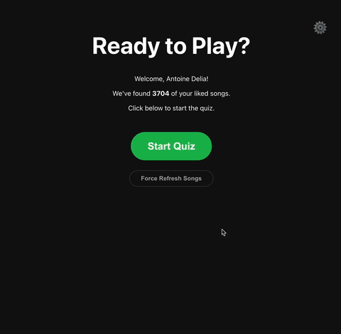

# Spotify Blindtest Quiz 🎧

Test your musical knowledge with an interactive blindtest quiz generated directly from your own Spotify Liked Songs! ✨ This is a serverless, front-end application that runs entirely in your browser.

## 🎥 Demo

<p align="center">
  
</p>

## 📖 About The Project

This project was built to create a fun, personalized music quiz experience. Instead of random songs, it connects securely to your Spotify account, pulls your library of liked songs, and challenges you to identify 15-second snippets. The faster you answer, the more points you get!

Because it's built without a backend and uses the Spotify Web Playback SDK, the entire experience, including audio playback, happens seamlessly within your web browser.

## ✨ Features

-   🔐 **Secure Spotify Authentication:** Uses the modern and secure Authorization Code Flow with PKCE.
-   🎶 **Personalized Quiz:** Every quiz is dynamically generated from *your* music library.
-   ⏱️ **Interactive Timed Rounds:** Each round plays a 15-second snippet with a visual countdown timer.
-   🏆 **Dynamic Scoring:** Gain more points for answering correctly *and* quickly.
-   ✅ **Instant Visual Feedback:** Answer buttons immediately turn green (correct) or red (incorrect).
-   🔊 **Direct Audio Playback:** Music plays directly in the browser thanks to the Spotify Web Playback SDK.
-   ☁️ **Fully Serverless:** No backend required! The app runs entirely on the client-side.

## 🖥️ Browser Compatibility

This application relies on advanced browser features for protected audio playback (Encrypted Media Extensions).

-   ✅ **Excellent support** is available on modern desktop browsers like **Chrome**, **Firefox**, **Safari**, and **Edge**.
-   ✅ **Mobile support** is fully functional on **Google Chrome for Android** and **Safari on iOS**.
-   ⚠️ **Known Issue:** Due to technical limitations in how protected audio is handled, playback is **not supported on Firefox for Android**. Users on this browser will be shown a warning.

For the best experience, please use a supported browser.

## 🔧 Built With

-   [React](https://reactjs.org/)
-   [Vite](https://vite.dev/)
-   [Spotify Web API](https://developer.spotify.com/documentation/web-api)
-   [Spotify Web Playback SDK](https://developer.spotify.com/documentation/web-playback-sdk)

## 🚀 Getting Started

To get a local copy up and running, follow these simple steps.

### ✅ Prerequisites

You will need the following software and accounts to run this project:

-   **Node.js & npm:** Download and install from [nodejs.org](https://nodejs.org/).
-   **Spotify Account:** A **Spotify Premium** account is required for the Web Playback SDK to play audio.

### ⚙️ Setup & Installation

1.  **Clone the repository:**
    ```sh
    git clone [https://github.com/antoinedelia/spotify-blindtest.git](https://github.com/antoinedelia/spotify-blindtest.git)
    cd spotify-blindtest
    ```

2.  **Set up your Spotify Application:**
    -   Go to the [Spotify Developer Dashboard](https://developer.spotify.com/dashboard) and log in.
    -   Click **"Create app"**.
    -   Give it a name (e.g., "React Blindtest") and a description.
    -   Once created, you will see your **Client ID**. Copy this value.
    -   Click on **"Settings"**.
    -   In the "Redirect URIs" section, add `http://localhost:5173` and click **"Save"**. This is crucial for the login flow to work locally.

3.  **Configure Environment Variables:**
    -   In the `web` directory of the project, find the `.env` files.
    -   Replace `VITE_SPOTIFY_CLIENT_ID` value with the actual Client ID you copied from the Spotify Developer Dashboard.
    -   Replace `VITE_REDIRECT_URI` value with your redirect URI.

4.  **Install NPM packages:**
    ```sh
    npm install
    ```

5.  **Run the application:**
    ```sh
    npm start
    ```

    Your browser should automatically open to `http://localhost:5173`, and you'll be ready to play!

## 🎮 Usage

Once the application is running:

1.  Click the "Login with Spotify" button.
2.  You will be redirected to Spotify to authorize the application.
3.  After authorization, you'll land on a "Ready to Play?" screen.
4.  Click "Start Quiz" to begin. Audio for the first song will start playing.
5.  Select the correct song title from the four options. Try to be as fast as you can!
6.  After 10 rounds, your final score will be displayed.

## 📜 License

Distributed under the MIT License. See `LICENSE` for more information.

## 🙏 Acknowledgments

-   A huge thanks to [Spotify](https://www.spotify.com) for providing the fantastic APIs that make this project possible.
-   [Create React App](https://github.com/facebook/create-react-app) for the project boilerplate.
